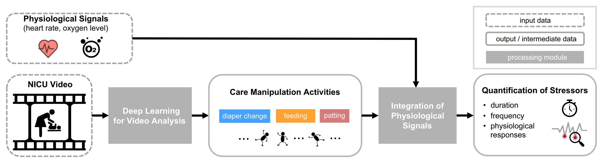
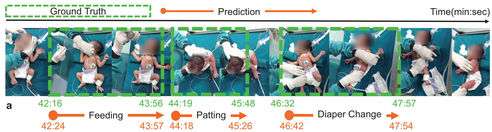

# Deep Learning to Quantify Care Manipulation Activities in NICUs

## Abstract
Early-life exposure to stress results in significantly increased risk of neurodevelopmental impairments with potential long-term effects into childhood and even adulthood. As a crucial step towards monitoring neonatal stress in neonatal intensive care units (NICUs), our study aims to quantify the duration, frequency, and physiological responses of care manipulation activities, based on bedside videos and physiological signals. Leveraging 289 hours of video recordings and physiological data within 330 sessions collected from 27 neonates in 2 NICUs, we develop and evaluate a deep learning method to detect manipulation activities from the video, to estimate their duration and frequency, and to further integrate physiological signals for assessing their responses. With a 13.8\% relative error tolerance for activity duration and frequency, our results were statistically equivalent to human annotations. Further, our method proved effective for estimating short-term physiological responses, for detecting activities with marked physiological deviations, and for quantifying the neonatal infant stressor scale scores.

## Method

We localize various care manipulation activities in NICU videos, identifying the type of action as well as the beginning and end timestamps using the deep learning model ActionFormer. This enables automated quantification of the frequency and duration of different manipulation activities experienced by neonates in NICUs. Furthermore, by combining this care manipulation data with the corresponding physiological signals (heart rate and SpO2), we demonstrate the assessment of neonatal responses to different manipulation activities.

## Code
Our method employs [ActionFormer](https://github.com/happyharrycn/actionformer_release) to localize various care manipulation activities in NICU videos. Since ActionFormer requires video features extracted using pre-trained deep video models, we utilized the [SlowFast](https://github.com/facebookresearch/SlowFast) model for feature extraction in our experiments. The features extracted by SlowFast from the NICU videos are then input into ActionFormer to detect and classify the different activities.

Thus, our analysis has two stages:
- Feature extraction
- Action Localization

##  Feature extraction
Our method utilizes SlowFast for feature extraction. Please follow the instructions within *slowfast-feats* directory for extracting features from your videos.

## Action Localization
We utilize ActionFormer for action localization. After extraction of features, please follow the instructions in *actionformer* directory to localize different activities in your videos.
    
   
## Contact:
Abrar Majeedi
majeedi+at+wisc+dot+edu